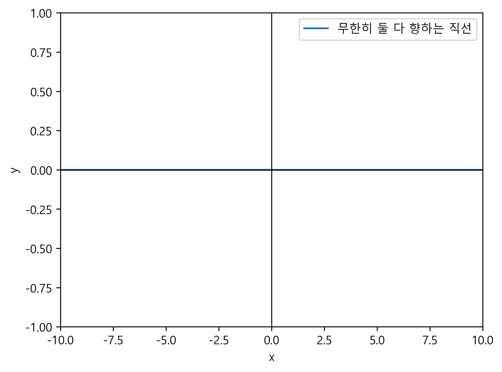

# 🎓 천재교육 EduCrew AI : 차세대 멀티 에이전트 자동 출제 시스템

 *(UI 예시 이미지)*

> **"로컬 오픈소스 LLM의 '가성비'와 상용 API의 '정밀함'을 융합하여, 
비용은 최소화하고 교육 콘텐츠의 품질은 극대화한 차세대 에듀테크 파이프라인"**

EduCrew AI는 천재교육 콘텐츠팀의 핵심 워크플로우(문항 출제 → 논리 검수 → 해설 생성)를 완전히 자동화하는 데스크톱 기반 AI 애플리케이션입니다. 최신 **Multi-Agent Orchestration(CrewAI)** 기술을 기반으로 다수의 인공지능이 서로 협력, 견제, 검증하며 시중 교재 수준의 고품질 문제를 끝없이 쏟아냅니다.

---

## 🌟 비즈니스 가치 (Executive Summary)

- 💰 **파격적인 비용 절감 (Zero-Cost Generation)**: 
  문제와 해설을 끝없이 만들어내는 '출제/해설' 작업은 데스크톱 내장 로컬 AI(Qwen3)가 전담하여 토큰 API 비용을 **0원**으로 만들었습니다.
- 🛡️ **결점 없는 품질 보증 (Zero-Defect Quality)**: 
  논리적 모순, 수식 오류, 어법 오류를 잡아내는 섬세한 '검수' 단계에만 클라우드 AI(GPT-4o-mini)를 선택적으로 투입하여 **최소 비용으로 최고 품질**을 달성했습니다.
- 🚀 **무한한 확장성 (Subject Plugin Architecture)**: 
  단일 과목에 종속되지 않는 플러그인 아키텍처를 도입하여, 향후 국어, 과학, 사회 등 **어떤 과목이든 단 5분 만에 파이프라인에 추가**할 수 있습니다.
- 🖨️ **즉시 배포 가능한 산출물 (Print-Ready PDF)**: 
  클릭 한 번으로 10문제가 담긴 모의고사를 출제하고, 천재교육 스타일의 세련된 2단 레이아웃 PDF로 자동 조판해 줍니다.

---

## 🛠 사용된 핵심 신기술 (Technology Stack)

본 프로젝트는 에듀테크와 AI 엔지니어링의 최전선 기술들을 적극 도입했습니다.

1. **CrewAI (Multi-Agent Orchestration)**: 단일 AI가 모든 것을 처리하는 기존 방식의 한계를 탈피하고, '출제자', '검수자', '해설가' 등 각각 고유의 페르소나와 권한을 가진 AI 에이전트들이 팀을 이뤄 작업합니다.
2. **Hybrid LLM Pipeline**: 
   - **Local LLM (`Qwen3:4b` via Ollama)**: 온프레미스(On-premise) 환경에서 초고속으로 동작하며 토큰 비용이 발생하지 않습니다.
   - **Cloud LLM (`GPT-4o-mini` via OpenAI)**: 고도의 논리적 추론이 필요한 단계에만 개입하여 로컬 모델의 한계(Hallucination)를 방어합니다.
3. **pywebview & MathJax**: 파이썬 백엔드와 완전히 분리된 최신 웹 기술(HTML5/CSS3) 기반의 세련된 데스크톱 UI를 제공하며, 복잡한 LaTeX 수식을 브라우저와 PDF 양쪽에서 완벽하게 렌더링합니다.
4. **Reportlab**: 동적 한글 폰트 로딩 및 과목별 특수 레이아웃(독해 지문 박스 등)을 지원하는 커스텀 PDF 조판 엔진입니다.

---

## 🏗 아키텍처 및 과목별 특화 전략

모든 과목은 `SubjectBase`라는 표준 인터페이스를 상속받는 **플러그인 구조**로 동작합니다. 하지만 각 과목별 특성에 맞추어 에이전트들의 사고 방식(Prompt)과 역할은 완전히 다르게 설계되었습니다.

### 📐 1. 수학 (Math) 파이프라인
수학 문제의 핵심은 '계산의 정확성'과 '논리적 오류 없음'입니다.
- **출제 마스터 (Local)**: 계산형, 문장제, 도형형 등 다채로운 맥락의 문제를 텍스트로 출제하며, 수식을 엄격한 표준 LaTeX 기호(`$ ... $`)로 작성합니다.
- **수학 검증 전문가 (GPT)**: 생성된 문제를 **자기가 직접 풀어보고(Self-Verification)**, 본인이 계산한 답이 객관식 1~5번 보기 중에 정확히 존재하는지 검증합니다. 정답이 지문에 노출되거나 보기에 답이 없으면 즉시 기각하고 재생성시킵니다.
- **해설 강사 (Local)**: 1단계 핵심 개념, 2단계 풀이 과정, 3단계 최종 정답으로 이어지는 체계적인 해설을 작성합니다.

### 🔤 2. 영어 (English) 파이프라인
영어 문제의 핵심은 '자연스러운 어법', '교육과정 적합도', '중의성 배제'입니다.
- **출제 전문가 (Local)**: 학년별 수준에 맞는 어휘와 문법(예: 중1 - 기초 시제, 고3 - 추상적 지문)을 선별하여 어휘/어법/독해 문제를 출제합니다.
- **원어민 영문법 감수관 (GPT)**: 수학처럼 계산하는 대신, **'성별 모호성'이나 '중복 정답 가능성'**을 치밀하게 잡아냅니다. (예: `This is my friend. ___ name is...` 와 같은 문제에서 his/her가 모두 정답이 될 수 있는 치명적 출제 오류를 AI가 스스로 인지하고 교정합니다.)
- **어법 해설 강사 (Local)**: 정답의 근거뿐만 아니라, 오답 보기가 문법적으로 왜 틀렸는지를 각 보기별로 1줄씩 상세히 짚어줍니다.

---

## 📁 디렉토리 구조도

```text
chunjae_crewai/
├── core/                # 🧠 과목 무관 공통 AI 엔진
│   ├── pipeline.py      # CrewAI 오케스트레이터 (에이전트 조율)
│   ├── pdf_generator.py # 레이아웃 엔진 (수학/영어 동적 분기)
│   ├── safety_review.py # 최종 안전성 2중 방어선
│   └── llm_registry.py  # 하이브리드 모델 분배기
│
├── subjects/            # 🧩 과목별 플러그인 (무한 확장 가능)
│   ├── base.py          # 플러그인 표준 인터페이스
│   ├── math/            # 수학 특화 (프롬프트, 페르소나, 메타데이터)
│   └── english/         # 영어 특화 (문법 검수 특화 로직 포함)
│
├── ui/                  # 🎨 완전히 분리된 프론트엔드 (데스크톱 뷰)
├── gui.py               # 🚀 데스크톱 앱 실행 진입점 (pywebview)
└── README.md            # 본 문서
```

---

*EduCrew AI는 단순한 자동화 스크립트를 넘어, 사람을 대신해 사고하고 서로를 검증하는 작은 '인공지능 교육 회사'를 당신의 PC 안에 구축한 결과물입니다.*
